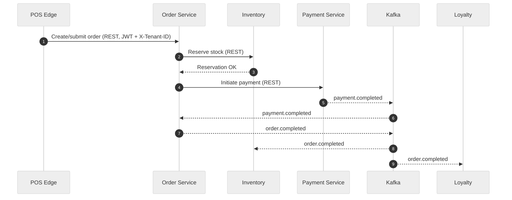
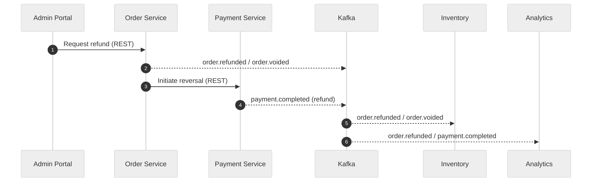
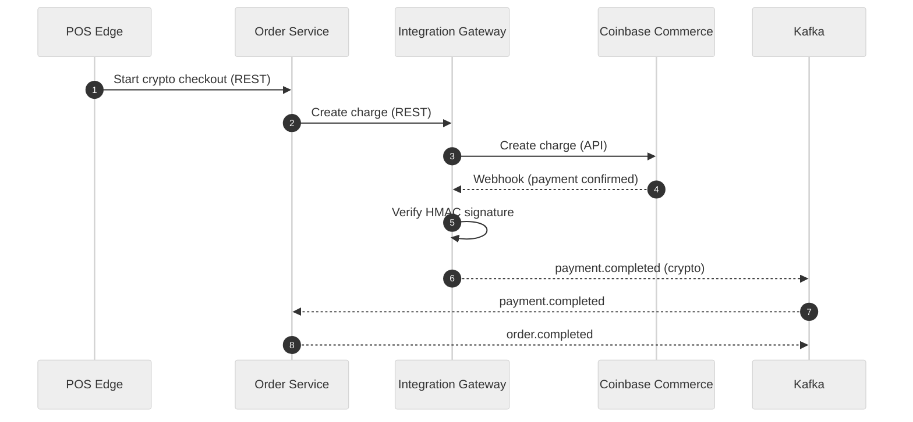
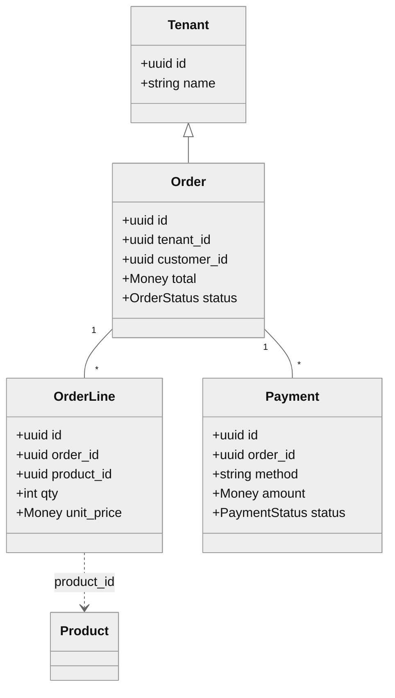
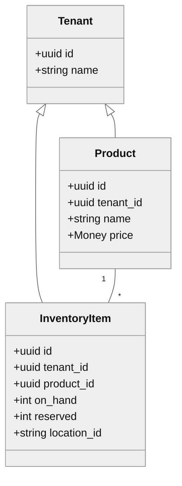
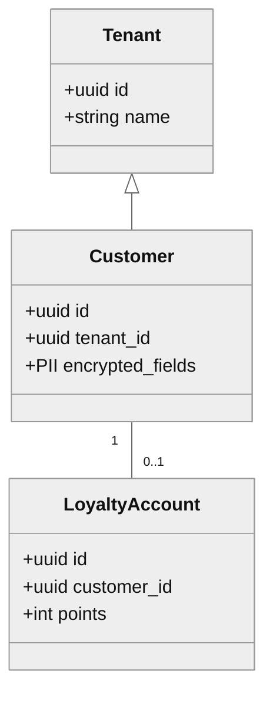

# NovaPOS Cloud POS Platform — Current Architecture Overview

NovaPOS is a distributed edge/cloud POS platform designed for multi-tenant SaaS. Stores run an offline-capable POS Edge Client, while cloud microservices (Rust, containerized) provide core business functions. Components are decoupled with events over Kafka and secured end-to-end for tenant isolation.


```mermaid
%%{init: { 'theme': 'neutral', 'themeVariables': { 'primaryColor': '#f7f9fc', 'lineColor': '#555', 'fontFamily': 'Inter, Segoe UI, Arial, sans-serif' } }}%%
flowchart LR
  %% Frontends
  subgraph Frontends
    POS["POS Edge Client\nReact PWA (offline)"]
    ADMIN["Admin Portal\nManagement UI"]
  end

  %% Kafka
  KAFKA["Kafka\norder.completed | order.voided | payment.completed"]

  %% Services
  subgraph Services (Rust)
    AUTH[Auth]
    PROD[Product]
    INV[Inventory]
    ORD[Order]
    PAY[Payment]
    IGW[Integration GW]
    CUST[Customer]
    LOY[Loyalty]
    ANA[Analytics]
  end

  %% Infra
  subgraph Infrastructure
    PG[("PostgreSQL\ntenant_id")]
    REDIS[(Redis)]
    VAULT[(Vault)]
  end

  %% Edges (REST)
  POS -- REST/JWT + X-Tenant-ID --> ORD
  ADMIN -- REST/JWT + X-Tenant-ID --> AUTH
  ADMIN -- REST --> PROD

  %% Sync between services
  ORD -- Reserve stock (REST) --> INV
  ORD -- Initiate payment (REST) --> PAY

  %% Events (Kafka)
  ORD -- order.completed --> KAFKA
  ORD -- order.voided --> KAFKA
  PAY -- payment.completed --> KAFKA
  KAFKA -- consume --> INV
  KAFKA -- consume --> LOY
  KAFKA -- consume --> ANA

  %% Data stores
  AUTH --- VAULT
  ORD --- PG
  PROD --- PG
  INV --- PG
  PAY --- VAULT
  IGW --- VAULT
  ORD --- REDIS
```

Legend: Solid arrows denote synchronous REST calls; arrows to/from Kafka nodes indicate event publication/consumption; dashed/labelled edges are illustrative only.

Related docs

- Roadmap Execution Checklist: [../RoadMap_Execution_Checklist.md](../RoadMap_Execution_Checklist.md)

## Contents

- Roadmap: [RoadMap_Execution_Checklist.md](../RoadMap_Execution_Checklist.md)

## System architecture overview

- Edge clients (React PWA) operate offline and sync when connectivity resumes.
- Cloud services (Rust) run in containers/orchestrators (Docker/Kubernetes).
- Asynchronous events on Kafka decouple workflows; REST handles synchronous calls.
- Strict multi-tenancy with tenant-scoped data and request validation.

When an order is voided, the Order Service emits an `order.voided` event for other services to consume instead of making direct calls. Similar topics like `order.completed` and `payment.completed` propagate state changes without tight coupling.

Requests must include an `X-Tenant-ID` header that matches the user’s JWT claims. All records carry a tenant identifier to ensure isolation.

## Edge POS and offline mode

The POS Edge Client is a React web app (tablet/kiosk friendly) deployed per store. It supports scanning, carts, payments, and receipt printing with a touch-first UX.

### Key capabilities

- Offline-first caching of catalog, pricing, and tax rules (IndexedDB/localStorage).
- Local transaction queue with idempotency keys; syncs to Order Service when online.
- Deferred updates: catalog/price changes apply on reconnection.
- Secure transport: TLS everywhere and device authentication.

Note: While syncing, the UI may show cached receipt data until cloud confirmation, leading to small, later-reconciled differences.

### Implementation notes

- POS Edge Client uses a PWA stack (Vite + `vite-plugin-pwa`) with Workbox for caching.
- Catalog data is cached per-tenant in `localStorage`; an offline order queue uses idempotency keys.
- Communicates with `order-service` and `integration-gateway` over REST; status polling is used (WebSocket scaffolding exists but backend WS is not implemented yet).

## Cloud backend and microservices

Containerized Rust services are deployable to Kubernetes or Docker Compose.

### Core services

- [Auth Service](../../services/auth-service/)
- [Product Service](../../services/product-service/)
- [Inventory Service](../../services/inventory-service/)
- [Order Service](../../services/order-service/)
- [Payment Service](../../services/payment-service/)
- [Integration Gateway](../../services/integration-gateway/)
- [Customer Service](../../services/customer-service/)
- [Loyalty Service](../../services/loyalty-service/)
- [Analytics Service](../../services/analytics-service/)

### Architecture highlights

- REST APIs today; GraphQL planned.
- Kafka for async events; REST for synchronous paths (e.g., Order → Inventory reservation).
- Multi-tenant PostgreSQL with `tenant_id` for row-level isolation.
- Shared infra: PostgreSQL, Redis, Kafka, Zookeeper, Vault.
- IaC with Terraform for AWS deployments.
- Independent deployability with health endpoints and observability.

## Multi-tenancy and data isolation

NovaPOS is built as a true multi-tenant SaaS with isolation at multiple layers.

### Enforcement layers

- Database: `tenant_id` on every table, tenant-scoped indexes.
- Application: `X-Tenant-ID` header + JWT claim validation via `SecurityCtxExtractor`.
- RBAC: roles (cashier, manager, admin) control UI and API privileges.
- Encryption: tenant-specific keys (envelope encryption via Vault).

This ensures both logical isolation (tenant-scoped queries) and cryptographic protection (per-tenant encryption).

## Secure integration and omnichannel

The Integration Gateway acts as a secure façade for partner APIs and omnichannel flows.

### Capabilities

Typical scenarios:

- Online orders → in-store inventory sync.

## AI and analytics stack

The Analytics & AI Service (port `8082`) consumes transactional and inventory events to power insights.

### Current functionality


- Aggregations: sales summaries, top sellers.
- Early AI: anomaly detection (e.g., refund spikes) and trend forecasting.
- Roadmap: demand forecasting, stock optimization, ML model integration.

Architecture is ready to offload to an analytical store or warehouse (e.g., BigQuery). Data is isolated per tenant and can be anonymized for cross-tenant learning.

## Components

### 1. POS Edge Client (frontend)

- React PWA optimized for touchscreen.
- Works offline (IndexedDB + local queue).
- Uses JWT + `X-Tenant-ID` for secure API calls.
- Prints receipts; payment terminal integration planned.
- Idempotency prevents duplicate orders during resync.

### 2. Back-office Admin Portal

- React web app (port `3001`) for management tasks.
- Features:
  - Product and inventory CRUD.
  - User management with role enforcement.
  - Order/return workflows.
  - Integration settings (API keys, tax rules).
  - Dashboards with analytics and alerts.
- Auth: JWT; routes guarded by role (e.g., `RequireRoles(["admin"])`).
- Built with Vite; simple RBAC implemented in `rbac.ts`.

### 3. Authentication and User Service (Auth Service)

- Port `8085`.
- Manages users, tenants, roles.
- Issues JWTs (RS256) with claims: `sub`, `tid`, `roles`.
- MFA (TOTP) for managers/admins.
- JWKS endpoint for token validation.
- API keys for external integrations.
- Comprehensive auth logging and audit.
- Vault integration at service startup to load secrets.
- Emits security activity events (e.g., `security.mfa.activity`).

Quick links:

- Port: `8085`  • Health: `/healthz`  • Metrics: `/metrics`
- Topics: [security.mfa.activity](#securitymfaactivity), [audit.events](#auditevents)

### 4. Product and Inventory Services

- Product Service (port `8081`): catalog CRUD, audit logs, price/tax data.
- Inventory Service (port `8087`): stock tracking, reservations, low-stock alerts.
- Shared money library for consistent rounding.
- Emits events like `product.updated`, `inventory.low_stock`.
- Supports multi-location inventory and a reservation TTL sweeper.
- Product Service emits `product.created`; Prometheus metrics at `/metrics` (legacy `/internal/metrics` still served).
- Inventory Service consumes `order.completed`, `order.voided`, `payment.completed`, `product.created`; emits `inventory.low_stock` and audit events.

Quick links:

- Product Service — Port: `8081` • Health: `/healthz` • Metrics: `/metrics`
- Inventory Service — Port: `8087` • Health: `/healthz` • Metrics: `/metrics`
- Topics: [product.created](#productcreated), [inventory.low_stock](#inventorylow_stock), [inventory.reservation.expired](#inventoryreservationexpired)

### 5. Order and Transaction Service

- Port `8084`.
- Manages orders, refunds, and voids.
- Responsibilities:
  - Validate and compute order totals.
  - Reserve inventory.
  - Initiate payments.
  - Generate receipts.
- Enforces idempotency to prevent duplicates.
- Consumes/publishes payment status via Kafka (e.g., `payment.completed`).
- Emits events for Inventory and Loyalty.
- Supports refunds/voids; automation via integrations is planned.
- Also consumes `payment.failed`; supports settlement reporting and tax-rate overrides.

Quick links:

- Port: `8084` • Health: `/healthz` • Metrics: `/metrics`
- Topics: [order.completed](#ordercompleted), [order.voided](#ordervoided), [payment.completed](#paymentcompleted), [payment.failed](#paymentfailed)

### 6. Payment Services

- Payment Service (port `8086`): handles card transactions (currently stubbed).
- Integration Gateway (port `8083`): manages crypto via Coinbase Commerce.
- Payment Service is typically fronted by the Integration Gateway.

Quick links:

- Payment Service — Port: `8086` • Health: `/healthz` • Metrics: `/metrics`
- Integration Gateway — Port: `8083` • Health: `/healthz` • Metrics: `/metrics`
- Topics: [payment.completed](#paymentcompleted)

Card payments:

- Placeholder for Valor PayTech terminal integration.
- Simulated approval workflow for MVP (no PAN/CVV stored).
- Future support: EMV, tap, signature capture.

Crypto payments:

- Integrates with Coinbase Commerce.
- Creates charge, receives webhook, publishes `payment.completed` to Kafka.
- Supports USDC and confirms blockchain transactions.
- Secrets in Vault; minimal PCI scope.

### 7. Customer and Loyalty Services

- Customer Service (port `8089`):
  - Stores encrypted PII (per-tenant keys).
  - CRUD and GDPR endpoints.
  - Uses per-tenant data-encryption keys (DEKs) stored in DB, encrypted with a master key (`MasterKey`).
  - Prometheus metrics at `/metrics` (legacy `/internal/metrics` still served).
- Loyalty Service (port `8088`):
  - Tracks points earned/redeemed.
  - Consumes `order.completed` events.
  - Manual adjustments and redemption API (in progress).
  - Emits `loyalty.events` for accrual/redemption.

  Quick links:

  - Customer Service — Port: `8089` • Health: `/healthz` • Metrics: `/metrics`
  - Loyalty Service — Port: `8088` • Health: `/healthz` • Metrics: `/metrics`
  - Topics: [order.completed](#ordercompleted), [loyalty.events](#loyaltyevents)
- Async by design: sales complete even if Loyalty is temporarily offline.
- Planned: tiering, offline caching, CRM integration.

### 8. Reporting and audit logging

- Common audit library produces Kafka `audit.events`.
- Append-only audit log planned for centralized persistence.
- Operational reporting via Order/Analytics APIs.
- Monitoring:
  - Prometheus/Grafana dashboards.
  - Structured JSON logs.
  - `trace_id` correlation across services.
- Planned: dedicated reporting + immutable audit microservice.

Quick links:

- Analytics — Port: `8082` • Health: `/healthz` • Metrics: `/metrics`
- Topics: [order.completed](#ordercompleted), [inventory.low_stock](#inventorylow_stock), [audit.events](#auditevents)

## Infrastructure & runtime

- Local development via Docker Compose provides Postgres (5432), Redis (6379), Zookeeper (2181), Kafka (9092), Vault (8200), plus all services on their listed ports.
- Terraform definitions for AWS deployments under `infra/terraform/dev`.
- Secrets management: Auth and Integration Gateway load secrets from Vault at startup; other services use environment variables in dev.

## Service matrix (local dev defaults — see `.env`/compose)

Ports shown reflect local development defaults sourced from `.env` and `docker-compose.yml`. In higher environments, ports may change (via env vars/ingress); prefer service discovery/ingress URLs over hard-coded ports.

Note: This table is auto-generated by `scripts/generate-service-matrix.ps1`. A local pre-commit hook and a CI check ensure it stays up to date. See `scripts/README.md` for details.

See also: Roadmap Execution Checklist for the sequential MVP plan — [../RoadMap_Execution_Checklist.md](../RoadMap_Execution_Checklist.md)

<!-- service-matrix:begin -->
| Service | Folder | Port (dev) | Health | Metrics | Primary topics |
|---|---|---:|---|---|---|
| Order | `services/order-service` | 8084 | `/healthz` | `/metrics` | Pub: [order.completed](#ordercompleted); [order.voided](#ordervoided) ; Con: [payment.completed](#paymentcompleted), [payment.failed](#paymentfailed) |
| Payment | `services/payment-service` | 8086 | `/healthz` | `/metrics` | Pub: [payment.completed](#paymentcompleted) |
| Auth | `services/auth-service` | 8085 | `/healthz` | `/metrics` | Pub: [security.mfa.activity](#securitymfaactivity); [audit.events](#auditevents) |
| Integration Gateway | `services/integration-gateway` | 8083 | `/healthz` | `/metrics` | Pub: [payment.completed](#paymentcompleted) |
| Loyalty | `services/loyalty-service` | 8088 | `/healthz` | `/metrics` | Pub: [loyalty.events](#loyaltyevents) ; Con: [order.completed](#ordercompleted) |
| Product | `services/product-service` | 8081 | `/healthz` | `/metrics` | Pub: [product.created](#productcreated) |
| Inventory | `services/inventory-service` | 8087 | `/healthz` | `/metrics` | Pub: [inventory.low_stock](#inventorylow_stock) ; Con: [order.completed](#ordercompleted), [order.voided](#ordervoided), [payment.completed](#paymentcompleted), [product.created](#productcreated) |
| Customer | `services/customer-service` | 8089 | `/healthz` | `/metrics` | Pub: [customer.created](#customercreated) ; Con: [order.completed](#ordercompleted) |
| Analytics | `services/analytics-service` | 8082 | `/healthz` | `/metrics` | Pub: [analytics.events](#analyticsevents) ; Con: [order.completed](#ordercompleted), [payment.completed](#paymentcompleted) |
<!-- service-matrix:end -->

## Messaging (Kafka topics)

### order.completed

- Published by: Order Service
- Consumed by: Inventory, Loyalty, Analytics

### order.voided

- Published by: Order Service
- Consumed by: Inventory, Analytics

### payment.completed

- Published by: Payment Service or Integration Gateway
- Consumed by: Order Service, Analytics

### payment.failed

- Consumed by: Order Service

### product.created

- Published by: Product Service
- Consumed by: Inventory, Analytics

### inventory.low_stock

- Published by: Inventory Service
- Consumed by: Analytics, alerting

### inventory.reservation.expired

- Published by: Inventory Service (audit)
- Consumed by: Analytics/ops

### customer.created

- Published by: Customer Service
- Consumed by: Analytics

### analytics.events

- Published by: Analytics Service
- Consumed by: Dashboards/observability sinks

### audit.events

- Published by: Common audit library
- Consumed by: Audit/ops

### security.mfa.activity

- Published by: Auth Service
- Consumed by: Security/ops

### security.alerts.v1

- Published by: Security components
- Consumed by: Ops

### loyalty.events

- Published by: Loyalty Service
- Consumed by: Analytics/ops

## Observability

- Health endpoints: `/healthz` on most services.
- Metrics: exposed at `/metrics` (legacy `/internal/metrics` still served for backward compatibility).
- Monitoring assets under `monitoring/` (Grafana/Prometheus dashboards and alert samples), with dashboards for Integration Gateway.

## Security overview

- Auth: JWT with role/capability checks (`common_security`) and a tenant guard validating `X-Tenant-ID` against JWT claims.
- Data protection: per-tenant encryption for Customer PII (DEKs protected by a master key) and comprehensive audit logging across domain actions.
- Rate limiting: Redis-backed limiter in Integration Gateway.
- TLS: terminate at ingress/reverse proxy in production; local dev uses HTTP in Compose.

## Data flows

### Checkout (card)

1. POS Edge creates order draft locally; on submit, sends to Order Service (REST, JWT + `X-Tenant-ID`).
2. Order Service validates, computes totals, reserves inventory (sync call to Inventory).
3. Order Service initiates payment via Payment Service.
4. Payment Service authorizes (stub/terminal); publishes `payment.completed` (Kafka).
5. Order Service marks order complete and publishes `order.completed` (Kafka).
6. Inventory consumes `order.completed` and finalizes stock changes; Loyalty accrues points.



Legend: Solid arrows show requests; `-->>` indicates messages/events; K represents Kafka topics; step numbers are for readability.

### Refund

1. Admin Portal requests refund to Order Service (REST).
2. Order Service validates policy and publishes `order.voided` or `order.refunded` (Kafka).
3. Payment Service processes reversal; emits `payment.completed` (Kafka) with refund metadata.
4. Inventory and Analytics consume events for stock and reporting updates.



Legend: Admin initiates via REST; Order emits `order.refunded`/`order.voided`; Payment emits `payment.completed (refund)`; Inventory/Analytics consume events.

### Crypto payment (Coinbase Commerce)

1. POS Edge selects crypto; Order Service asks Integration Gateway to create a charge.
2. Shopper completes payment; Coinbase sends webhook to Integration Gateway.
3. Integration Gateway verifies HMAC, then publishes `payment.completed` (Kafka).
4. Order Service consumes `payment.completed`, completes the order, emits `order.completed`.



## Entity relationships by bounded context

### Order context



Legend: `<|--` indicates tenant scoping; `1--*` shows cardinality; dotted `..>` shows a reference to an external context (Product).

### Product context



Legend: Inventory is per-product and per-location; fields simplified (pricing/tax rules omitted for clarity).

### Customer and Loyalty context



Legend: Customer PII is encrypted; loyalty account is optional and belongs to a single customer.

## Conclusion

NovaPOS delivers a cloud-native, multi-tenant POS with offline resilience, modular microservices, and an event-driven core.

### Strengths

- Modular and decoupled via Kafka events.
- Offline-capable edge clients.
- Strong tenant isolation and encryption.
- Extensible for omnichannel and AI integrations.

### Evolving areas

- Hardware payment terminal integration.
- Automated refunds and reversals.
- Advanced analytics and loyalty tiering.
- Dedicated audit/reporting service.
- Device authentication at the backend.
- WebSocket order status (currently polling in POS; backend WS not implemented).
- Broader Vault adoption across services (beyond Auth/Integration Gateway).
- Metrics path standardization (`/metrics` vs `/internal/metrics`).
- GraphQL (planned; REST-only today).

## Sources

Derived from the current NovaPOS codebase, architecture proposals, MVP runbooks, and configuration files.

References

- Compose: `docker-compose.yml`
- Terraform: `infra/terraform/dev/`
- Frontends: `frontends/pos-app`, `frontends/admin-portal`
- Services: `services/*`

---

## Appendix: Dev runbook (quick checks)

Compose dev ports (from `docker-compose.yml`):

- Product 8081, Analytics 8082, Integration Gateway 8083, Order 8084, Auth 8085, Payment 8086, Inventory 8087, Loyalty 8088, Customer 8089.
- Platform: Postgres 5432, Redis 6379, Kafka 9092, Zookeeper 2181, Vault 8200.

Health checks (PowerShell):

```powershell
curl http://localhost:8084/healthz
curl http://localhost:8085/healthz
curl http://localhost:8081/healthz
```

Metrics (PowerShell):

```powershell
curl http://localhost:8084/metrics
curl http://localhost:8081/metrics
```

Kafka topic smoke (if CLI available):

```powershell
# Example: list topics
# kafka-topics --bootstrap-server localhost:9092 --list
```

