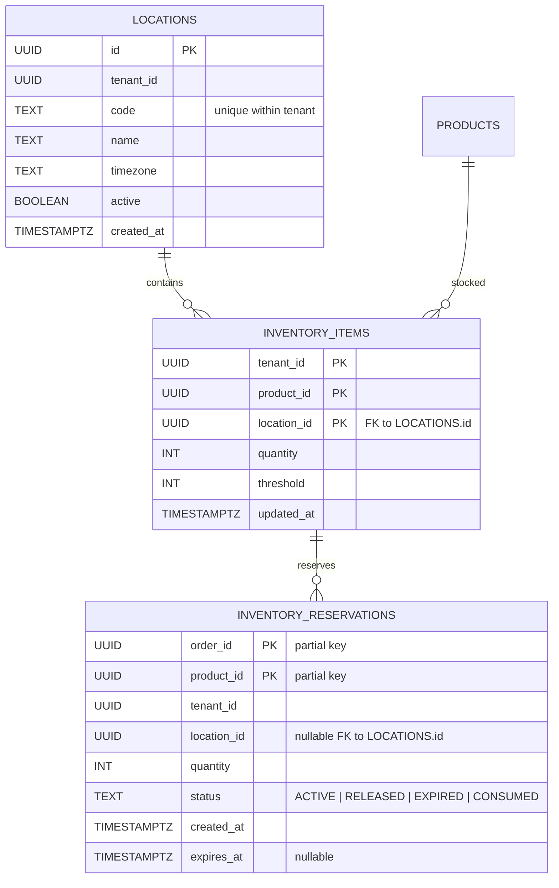

# Multi-Location Inventory ERD (Phase 1)

## Phased Rollout

1. Add new tables (no behavior change) + backfill default location per tenant.
2. Introduce feature flag `MULTI_LOCATION_ENABLED`:
   - If false: existing endpoints continue to read legacy `inventory` + aggregated reservation logic.
   - If true: new writes go to `inventory_items`; reads aggregate across locations unless filtered.
3. Dual-write window (optional) with periodic consistency check query.
4. After confidence, cut over: stop writing to legacy `inventory`; retain temporarily for rollback.
5. Later Phase: remove legacy table after N releases.

## Reservation Expiration

Add `expires_at` + `status` to support:

- Background sweeper scanning for `status='ACTIVE' AND expires_at < now()` -> set `status='EXPIRED'` and re-credit stock.
- Emit Kafka event `inventory.reservation.expired` for audit/metrics.

## Future Extensions

- Location groups / channels (e.g., ONLINE vs STORE) with allocation strategies.
- Soft delete locations (active flag) + transfer utility.
- Low stock threshold overrides per location.
- Event sourced adjustments log.
